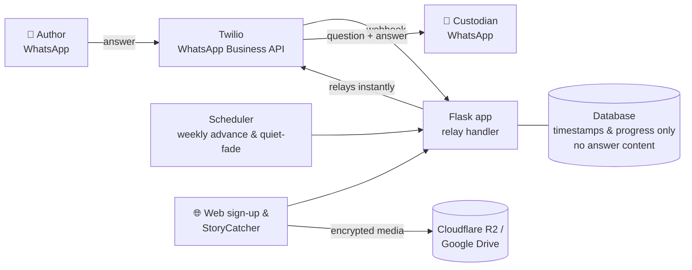

# 🌸 In My Time

**A WhatsApp-based family-history service that captures a grandparent's life story, one question a week, without ever storing it.**

🔗 **Live:** [www.inmytime.app](https://www.inmytime.app)
🔒 *Source code is private. I'm happy to walk through it in an interview.*

---

## The problem

Most families only realise how much of a parent's or grandparent's story they never heard once it is too late to ask. The tools that exist ask older people to learn an app, write long answers, or hand their memories to a company's servers.

In My Time works through the one app most grandparents already use, **WhatsApp**, and it is built so that **the story belongs to the family, not to the platform.**

## How it works

1. **An adult child (the "custodian") signs up on the website** and chooses which chapters of a life to explore.
2. **The grandparent (the "author") receives a single WhatsApp consent message.** Nothing starts until *they* reply. Consent is in their hands, not a checkbox someone else ticked.
3. **Every Sunday the author gets one gentle question** from a 34-question journey across 8 chronological chapters: Childhood, People I loved, Working life, Places & journeys, and more.
4. **They answer however suits them:** text, a voice note or a photo. Each answer is **relayed instantly to the custodian**, with the question attached.
5. **Want to go deeper?** The author can reply *"more"* at any time for a tailored follow-up question.

## Privacy by design: the "shallow room"

The core architectural decision:

> **The server relays each answer in the same request and stores nothing.** It keeps no message text and no transcriptions, and media is forwarded by reference and never downloaded.

- The database schema **has no column capable of holding an answer**. If an `answers` table ever appears in a migration, that is treated as an alarm bell.
- The only records kept are timestamps and the author's position in the question sequence.
- Even the admin view shows only progress (chapter, reply counts, days since last reply), **never story content**, including to me.
- Sign-up uses structured choices rather than free text, so no special-category personal data is collected.

### Designing for the end of life

The system **never assumes a death**. If an author goes quiet, it pauses patiently, then sends one gently worded check-in to the *custodian*, never to the author. Closing steps begin only after the family confirms. The worst case is always "it went quiet and waited", never a wrong assumption.

## StoryCatcher: recorded family interviews

A second module lets family members record interviews with relatives in the browser:

- 🎙️ **Guided interviews** using curated question packs, including packs derived from the **1937 Schools' Collection** (Irish Folklore Commission survey headings)
- 🔐 **Client-side encryption:** recordings and names are encrypted in the browser, with per-interviewee keys
- 👥 **Per-interviewee access control:** the account holder can invite reporters for specific people and revoke access individually, enforced server-side on every route
- 📸 **Photo capture** during a recording, plus an optional portrait on each interviewee's card
- 🗂️ **Bring-your-own storage:** recordings can go to Cloudflare R2 or the family's own Google Drive (OAuth with resumable uploads)
- 🕰️ **LifeLine:** a scrollable timeline from pre-1900 to today, where clips and notes are pinned to a decade and theme alongside world events for context

## Architecture

## Tech stack

| Area | Technologies |
|---|---|
| Backend | Python, Flask, scheduled jobs |
| Messaging | Twilio, WhatsApp Business API, Meta-approved message templates |
| Storage | Relational database (progress only), Cloudflare R2, Google Drive API |
| Security | Client-side encryption, per-interviewee keys, server-side access control, OAuth |
| Internationalisation | Flask-Babel, with a full German translation (~966 strings) |
| Infrastructure | Cloudflare DNS, Let's Encrypt, PythonAnywhere, GitHub |
| Testing | Automated API test suites and end-to-end Playwright browser tests (real encryption, recording and playback) |

## Problems I solved along the way

**🔕 Alerts that failed silently.** Admin alerts weren't arriving, yet the messaging API reported every send as successful. The root cause was WhatsApp's 24-hour session rule: free-form messages are only delivered while a conversation is open. I added an automatic fallback to a pre-approved template message, with tests covering both paths.

**🧵 Lost context on follow-up answers.** When an author asked for a follow-up question, the custodian couldn't tell which question the reply answered. I added a short-lived pending-follow-up field (holding question text only, never answers) so the right question is attached to the next reply, and it clears automatically so stale context can't leak into later replies.

**🔐 HTTPS certificates that wouldn't issue.** Certificate validation kept failing because of how the registrar's DNS handled the record setup. Moving DNS to Cloudflare, with the records set to DNS-only, fixed it cleanly.

**🌍 Adding languages properly.** Rather than translating page by page, I built the internationalisation at the foundation, so adding a new language is now a documented, repeatable process.

## What this project demonstrates

- Designing **privacy into the architecture**, not bolting it on afterwards
- Building on **real-world messaging platforms** and working within their rules (consent, templates, session windows)
- **Careful product thinking** for a sensitive, older audience
- **Testing at depth**, including browser tests that exercise real encryption and media playback

---

*Built by [Barry Sisk](https://github.com/BBSISK) · Higher Diploma in Software Development, Maynooth University*
